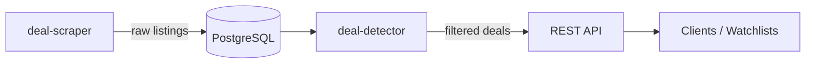

<div align="center">

# deal-detector

### Backend engine for detecting underpriced marketplace listings.

<br/>


</div>

---

Marketplace listings go stale fast. deal-detector sits downstream of a scraper pipeline, applying pricing baselines and keyword normalisation against a live PostgreSQL database to surface listings that are statistically underpriced. Users create watchlists for categories they care about; the engine does the rest.

Part of a two-service system — see also [deal-scraper](https://github.com/psilde/deal-scraper).

---

## System Architecture



---

## Core Features

- **Pricing baseline engine** — compares each listing against category averages to flag statistical outliers
- **Keyword normalisation** — strips noise from listing titles before analysis so comparisons are consistent
- **Database-level filtering** — heavy lifting happens in SQL queries, not application memory, for efficient handling of large datasets
- **User watchlists** — authenticated users subscribe to categories; deals are scoped to their watchlists
- **JWT authentication** — stateless auth via Spring Security; all endpoints protected by role
- **Structured error handling** — centralised `@ControllerAdvice` returns consistent JSON error shapes across the API

---

## Tech Stack

| Technology | Purpose |
|---|---|
| Java + Spring Boot | Core application framework |
| Spring Security + JWT | Stateless authentication and endpoint protection |
| PostgreSQL | Relational store; complex filtering queries run at DB level for performance |
| Flyway | Version-controlled schema migrations |
| Docker | Containerised local dev and deployment |

---

## Getting Started

```bash
# 1. Clone
git clone https://github.com/psilde/deal-detector.git
cd deal-detector

# 2. Start the database
docker compose up -d

# 3. Run the application
./mvnw spring-boot:run
```

Flyway runs migrations automatically on startup. No manual schema setup required.

---

## API Overview

| Method | Endpoint | Description | Auth |
|---|---|---|---|
| `POST` | `/auth/register` | Register a new user | — |
| `POST` | `/auth/login` | Authenticate and receive JWT | — |
| `GET` | `/listings` | Browse all listings, filter by keyword | — |
| `POST` | `/watchlists` | Create a watchlist | JWT |
| `GET` | `/watchlists` | List your watchlists (paginated, sortable) | JWT |
| `PUT` | `/watchlists/{id}` | Update a watchlist | JWT |
| `DELETE` | `/watchlists/{id}` | Delete a watchlist | JWT |
| `GET` | `/watchlists/{id}/matches` | Get deal matches for a watchlist | JWT |
| `POST` | `/admin/sync` | Push listings directly (batch) | Secret |
| `POST` | `/admin/ingest` | Pull & ingest from scraper API | Secret |

JWT-protected endpoints require `Authorization: Bearer <token>`. Admin endpoints require `X-Admin-Secret` header.

---

## deal-scraper

Listing ingestion: https://github.com/psilde/deal-scraper
